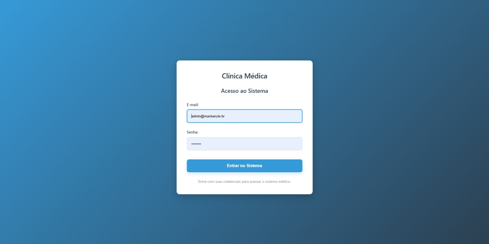
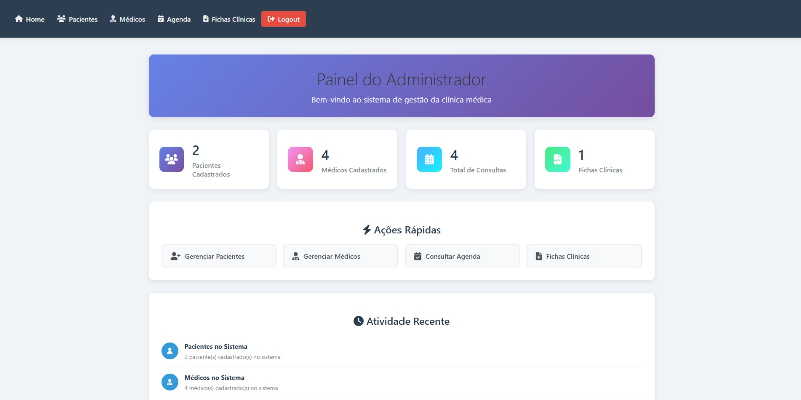
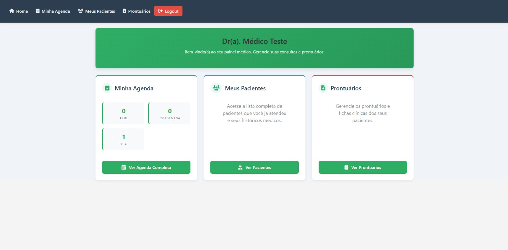
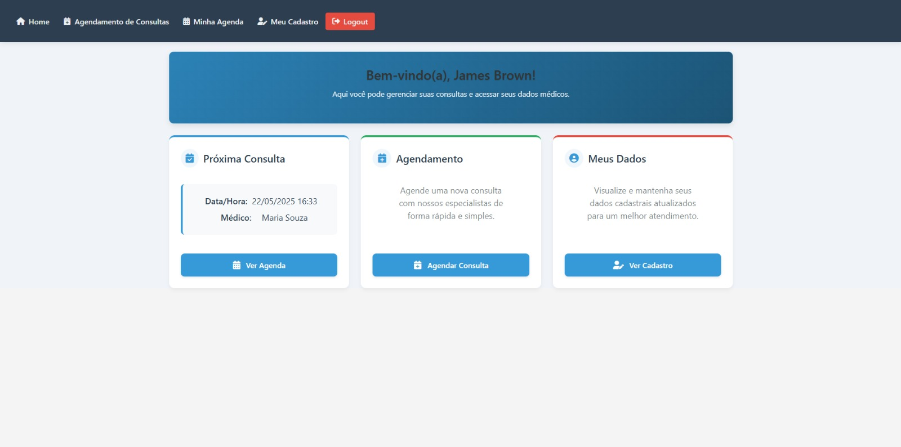
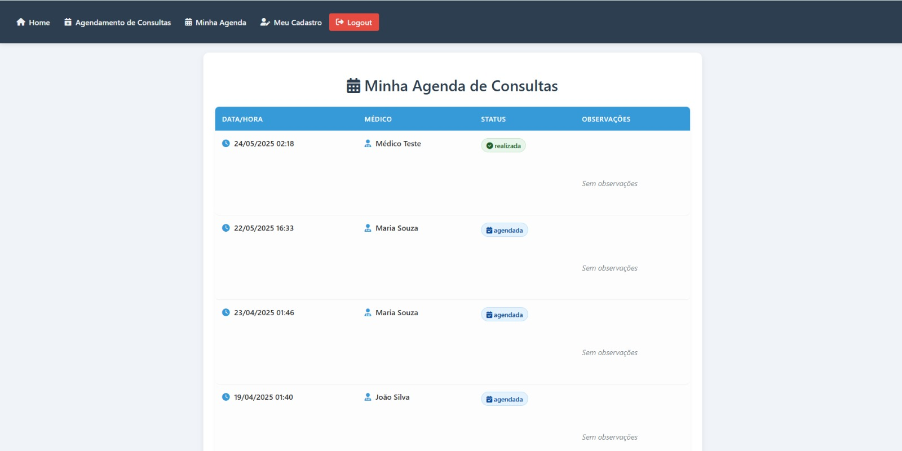
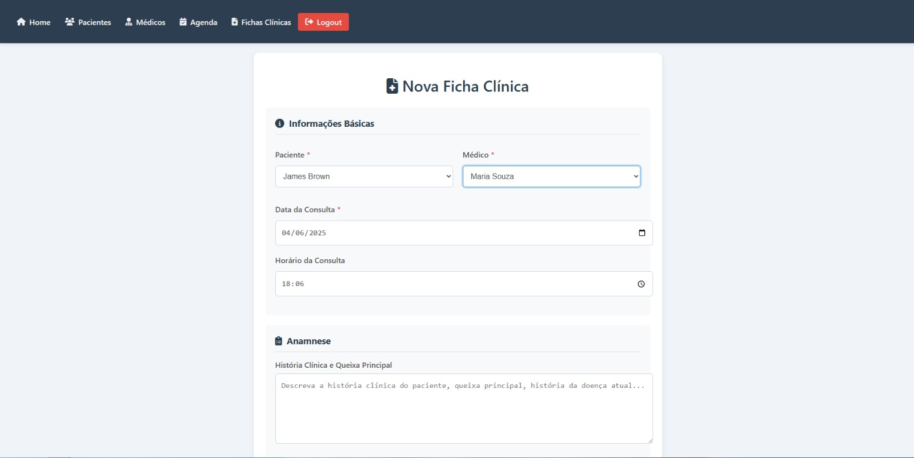

# Sistema de Gestão de Clínica Médica

Este projeto consiste em um sistema web para agendamento e gestão de consultas médicas para clínicas, desenvolvido com tecnologias Java EE, seguindo a arquitetura MVC (Model-View-Controller).








## Tecnologias Utilizadas

- **Java Servlets**: Para processamento de requisições no servidor
- **JSP (JavaServer Pages)**: Para renderização da interface do usuário
- **JSTL (JavaServer Pages Standard Tag Library)**: Para manipulação de dados nas páginas JSP
- **SQLite**: Banco de dados leve e embarcado
- **CSS**: Estilização das páginas para uma interface responsiva
- **JavaScript**: Validações no lado do cliente e melhorias de UX

## Estrutura do Projeto

O projeto segue a estrutura padrão Maven:

```
clinica/
├── pom.xml                               # Configurações do Maven e dependências
├── db.db                                 # Banco de dados SQLite
├── src/
│   └── main/
│       ├── java/
│       │   └── com/
│       │       └── mack/
│       │           └── clinica/
│       │               ├── controller/   # Servlets (Controllers)
│       │               ├── dao/          # Camada de acesso a dados (DAOs)
│       │               ├── model/        # Classes de domínio (JavaBeans)
│       │               └── util/         # Classes utilitárias (ex: DBUtil)
│       ├── resources/                    # Arquivos de configuração (se houver)
│       └── webapp/
│           ├── css/                      # Arquivos de estilo CSS
│           ├── js/                       # Scripts JavaScript (validações, etc.)
│           ├── images/                   # Imagens
│           ├── WEB-INF/
│           │   ├── jspf/                 # Fragmentos JSP (menus, rodapés, etc.)
│           │   ├── web.xml               # Descritor de implantação da aplicação web
│           │   └── db.db                 # Cópia do banco de dados (acessado via ServletContext)
│           └── *.jsp                     # Páginas JSP (Views)
└── target/                                 # Arquivos compilados e o .war
```

## Principais Componentes

### Modelos (Models)

- `Usuario.java`: Representa um usuário do sistema (administrador, paciente ou médico). Contém dados como id, nome, email, cpf, celular, tipo, senha (para autenticação), data de criação e data de nascimento.
- `Consulta.java`: Representa uma consulta agendada. Inclui informações como id da consulta, IDs do paciente e do profissional, data/hora, status e observações. Também pode carregar o nome do profissional e do paciente para exibição.

### Acesso a Dados (DAOs)

- `UsuarioDAO.java`: Gerencia todas as operações de banco de dados relacionadas aos usuários (CRUD para pacientes e médicos, busca para login, verificações de duplicidade).
- `ConsultaDAO.java`: Responsável pelas operações de banco de dados para consultas (agendar, listar por paciente, listar por médico, contar consultas).
- `DBUtil.java`: Classe utilitária para gerenciar a conexão com o banco de dados SQLite, utilizando o `ServletContext` para localizar o arquivo `db.db` dentro de `WEB-INF`.

### Controladores (Servlets)

- `LoginServlet.java` (ou `LoginActionServlet.java`): Controla o processo de autenticação dos usuários e redireciona para os dashboards apropriados.
- `LogoutServlet.java`: Invalida a sessão do usuário.
- **Pacientes:**
    - `MeuCadastroServlet.java`: Busca e exibe os dados cadastrais do paciente logado.
    - `MinhaAgendaServlet.java`: Lista as consultas agendadas para o paciente logado.
    - `AgendarConsultaServlet.java`: Processa o agendamento de novas consultas.
- **Administradores:**
    - `AdminDashboardServlet.java`: Prepara dados e estatísticas para o painel do administrador.
    - `PacientesServlet.java`: Gerencia o CRUD completo de pacientes (listar, novo, criar, editar, atualizar, excluir).
    - `MedicosServlet.java`: (Em desenvolvimento) Gerenciará o CRUD de médicos.
- **Médicos:**
    - `MedicoDashboardServlet.java`: Prepara dados para o painel do médico.
    - `MeusPacientesServlet.java`: Lista os pacientes atendidos pelo médico logado.

### Páginas JSP (Views)

- `index.jsp`: Página inicial com formulário de login.
- `paciente_dashboard.jsp`: Painel principal do paciente.
- `admin_dashboard.jsp`: Painel principal do administrador.
- `medico_dashboard.jsp`: Painel principal do médico.
- `meu_cadastro.jsp`: Exibe os dados cadastrais do paciente.
- `minha_agenda.jsp`: Lista as consultas agendadas pelo paciente.
- `agendar_consulta.jsp`: Formulário para agendamento de consultas.
- `listar_pacientes.jsp`: (Admin) Lista de pacientes com opções de CRUD.
- `form_paciente.jsp`: (Admin) Formulário para cadastro/edição de pacientes.
- `listar_medicos.jsp`: (Admin - A ser criado) Listará os médicos.
- `form_medico.jsp`: (Admin - A ser criado) Formulário para cadastro/edição de médicos.
- `meus_pacientes.jsp`: (Médico) Lista os pacientes atendidos pelo médico.

### Componentes Reutilizáveis (JSPF)

- `WEB-INF/jspf/menu_paciente.jspf`: Menu de navegação para o dashboard do paciente.
- `WEB-INF/jspf/menu_admin.jspf`: Menu de navegação para o dashboard do administrador.
- `WEB-INF/jspf/menu_medico.jspf`: Menu de navegação para o dashboard do médico.

## Funcionalidades Implementadas

### Comuns
- Autenticação de usuários (Login/Logout) com redirecionamento baseado no tipo.
- Dashboards distintos para Paciente, Administrador e Médico.

### Para Pacientes
- **Meu Cadastro**: Visualização dos dados pessoais.
- **Minha Agenda**: Listagem das consultas agendadas.
- **Agendar Consulta**: Funcionalidade de agendar novas consultas (já fornecida inicialmente).

### Para Administradores
- **Dashboard**: Visualização de estatísticas (total de pacientes, médicos, consultas).
- **Cadastro de Pacientes**: CRUD completo (Listar, Criar, Editar, Excluir).

### Para Médicos
- **Dashboard**: Painel inicial do médico.
- **Meus Pacientes**: Listagem de pacientes que possuem consultas com o médico logado, exibindo o total de consultas por paciente.

## Funcionalidades Pendentes (Escopo do Projeto)

### Para Administradores
- **Cadastro de Médicos**: CRUD completo (Interface e Servlet).
- **Consultar Agenda**: Visualizar todas as consultas com filtros (paciente, médico, data).
- **Ficha Clínica (Prontuário)**: Estrutura inicial de um formulário simples (não funcional).

### Para Médicos
- Gerenciar horários (Não explicitamente no escopo, mas relacionado a `profissional_id` em consultas).
- Manter registros simples de atendimento (Relacionado à Ficha Clínica/Prontuário).

## Banco de Dados (`db.db`)

O sistema utiliza SQLite com as seguintes tabelas principais:

- **`usuarios`**:
    - `id` INTEGER PRIMARY KEY AUTOINCREMENT
    - `nome` TEXT NOT NULL
    - `email` TEXT UNIQUE NOT NULL
    - `cpf` TEXT UNIQUE NOT NULL
    - `celular` TEXT
    - `tipo` TEXT NOT NULL CHECK(tipo IN ('paciente', 'admin', 'medico'))
    - `senha` TEXT NOT NULL
    - `created_at` DATETIME DEFAULT CURRENT_TIMESTAMP
    - `data_nascimento` DATE
- **`consultas`**:
    - `id` INTEGER PRIMARY KEY AUTOINCREMENT
    - `paciente_id` INTEGER NOTIONAL NULL REFERENCES usuarios(id)
    - `profissional_id` INTEGER NOT NULL REFERENCES usuarios(id)
    - `data_hora` DATETIME NOT NULL
    - `status` TEXT DEFAULT 'Agendada' CHECK(status IN ('Agendada', 'Realizada', 'Cancelada'))
    - `observacoes` TEXT
- **`prontuarios`** (Ficha Clínica):
    - `id` INTEGER PRIMARY KEY AUTOINCREMENT
    - `paciente_id` INTEGER NOT NULL REFERENCES usuarios(id)
    - `profissional_id` INTEGER NOT NULL REFERENCES usuarios(id)
    - `consulta_id` INTEGER REFERENCES consultas(id) -- Adicionado para vincular ao agendamento
    - `data` DATE NOT NULL
    - `anotacoes_medicas` TEXT
    - `prescricoes` TEXT

*Observação: A coluna `consulta_id` foi sugerida para a tabela `prontuarios` para melhor relacionamento, verifique se já existe ou se pode ser adicionada ao seu `db.db`.* 

## Instalação e Execução

1.  **Pré-requisitos**:
    *   JDK 11 ou superior instalado e configurado (`JAVA_HOME`).
    *   Apache Maven instalado e configurado (`MAVEN_HOME`, `Path`).
2.  **Clone o repositório**:
    ```bash
    git clone https://github.com/EduardoFdeM/projetoPooClinica.git
    cd clinica
    ```
3.  **Compile e instale as dependências com Maven**:
    Abra um terminal na raiz do projeto (onde está o `pom.xml`) e execute:
    ```bash
    mvn clean install
    ```
    Este comando limpa o projeto, baixa as dependências, compila o código e empacota a aplicação.
4.  **Execute a aplicação com o Jetty (servidor embutido)**:
    No mesmo terminal, execute:
    ```bash
    mvn jetty:run
    ```
5.  **Acesse o sistema**:
    Abra seu navegador e acesse: `http://localhost:8080/clinica` (ou apenas `http://localhost:8080/` se o `artifactId` for o nome do contexto raiz).

## Credenciais de Acesso (Padrão - `db.db` inicial)

-   **Administrador**:
    -   Usuário: `admin@mackenzie.br`
    -   Senha: `admin123`
-   **Paciente Exemplo**:
    -   Usuário: `james.brown@soul.com` (verifique outros no `db.db`)
    -   Senha: `123`
-   **Médico Exemplo**: (Cadastre um médico através da interface de admin ou diretamente no `db.db` para testar)

## Observações Importantes

*   O arquivo do banco de dados `db.db` deve estar localizado em `src/main/webapp/WEB-INF/`. O `DBUtil.java` utiliza o `ServletContext` para encontrar este caminho.
*   Sempre que houver alterações em arquivos `.java`, é necessário parar o servidor Jetty (Ctrl+C no terminal) e rodar `mvn clean install` seguido de `mvn jetty:run` novamente.
*   Para desenvolvimento, pode ser útil usar uma ferramenta de visualização de banco de dados SQLite (como DB Browser for SQLite) para inspecionar e modificar o `db.db`.

---

Projeto desenvolvido como parte da disciplina de Programação Orientada a Objetos. 